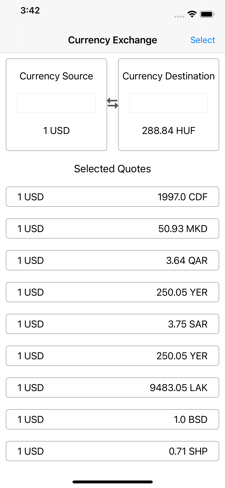
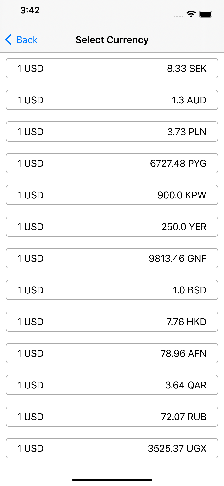

# PayPay Code Challenge Test

# About Project 

## 1. First screen - Currency Coversion & Fetching Favorite Quotes : 
- Shows the Currency conversion View that could be used to convert from `Source` to `Destination` currency.
- First screen shows list of `selected` quotes at the bottom of the currency conversion view.
- When tapped on a `selected` currency the same conversion is populated in the currency conversion view.

## 2. Second screen - Add/Select Currency: 
- Second screen shows list of all the quotes fetched from mentioned API. 
- The response is cached till 30 mins and post that a fresh API call is made and the local storage is also refreshed. 
- When user taps on a quote in the tableview that quote is added as favorite in the local DB. 
- In addition to it, user is also shown selecetd quotes on the First screen at the bottom of conversion view.

# Architectural Information:
This project uses `MVVM` architecture.

# Requirements:
* iOS 14.2+
* Xcode 12.2 +
* Swift 5.3.1

# ScreenShots:

